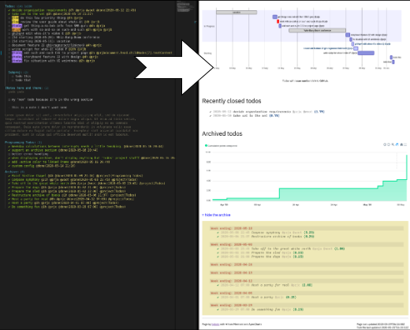
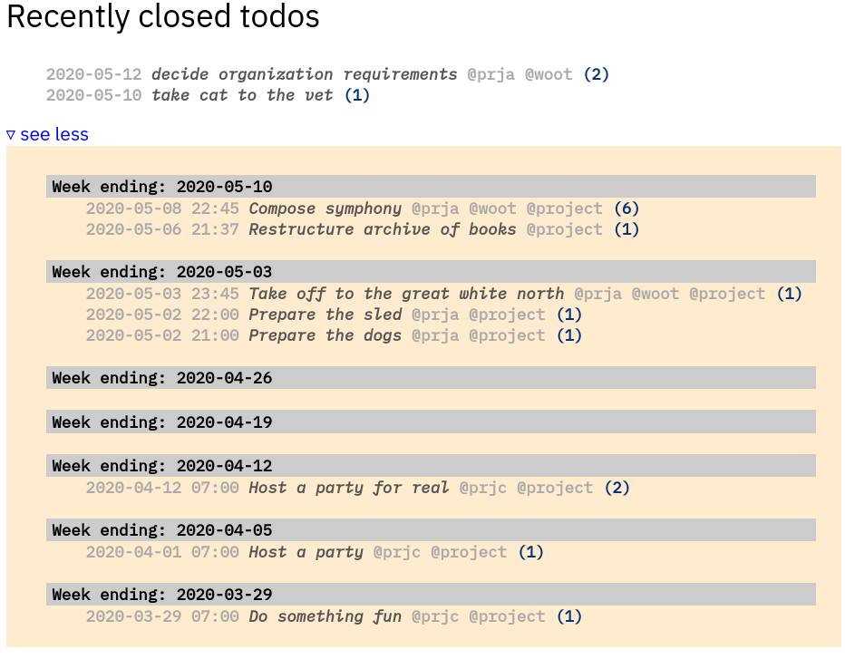
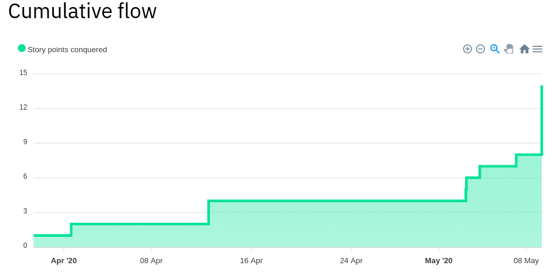

= hqtodo
:toc:
:toc-placement!:
ifdef::env-github[]
:tip-caption: :bulb:
:note-caption: :information_source:
:important-caption: :heavy_exclamation_mark:
:caution-caption: :fire:
:warning-caption: :warning:
endif::[]
ifndef::env-github[]
:icons: font
endif::[]

pass:[
]

A li'l web app (page) to display todo items that are created with
the Todo+ extension for VS Code or the Plaintasks package for Sublime Text.
The open items are shown as a
https://mermaid-js.github.io/mermaid/#/gantt[Mermaid]
Gantt chart.
Tasks always shift with time, starting from now into the future.
It's meant for todos knocked out at a regular story point velocity per day
and labeled in a particular way.

[.thumb]

{empty} +

Completed items are displayed underneath, with _Archived_ items available.

[.thumb]

{empty} +

An https://apexcharts.com/[ApexFlow] chart shows the cumulative story points
you've knocked out.

[.thumb]

== Run

Currently requires NodeJS v12.

Copy the `config/default.json` file to `config/production.json`
and add your info to the new file.
You can put the TODO file anywhere on the file system the app can access
such as a shared Cloud or Network mounted folder.

Then, install and launch:

[source, bash]
----
npm install
./run
----

////
== Deploy

For example with `systemd` on Linux:

[source,bash]
----
vi misc/hqtodo.service # change the absolute paths and user
sudo cp misc/hqtodo.service /etc/systemd/system/
sudo systemctl start hqtodo
sudo journalctl -f # to verify. Also test in a browser
sudo systemctl enable hqtodo
----
////

== Use

Everything in the TODO file is ignored except:

- the _Todo items_ between the `Todos:` project and the `Notes:` project.
- the _Todo items_ after `Archive:`

See the sample `TODO` file.

For the app to work, there's a simple pattern to follow for the Todo items:

[source,bash]
----
☐ [@today|@high|@low] <todo description> [@Nh] [@custom ]*
----

* Priority tagging:
** Items prefixed with `@today` are placed in order in the "`In Progress`" section.
** Items with no priority label are listed in order in the "`Backlog`" section.
** Items prefixed with `@high` are colored red.
** Items prefixed with `@low` are not displayed. (This is your Icebox.)
* The optional `@Nh` tag indicates your estimated N hours. No tag gets the default of 2 hours.
* You can provide any number of `@custom` tags for your own custom filtering.
  They're simply displayed with the title.
* When you press `Super-D` to mark a task with a checkmark and a `@done` tag, it's listed
  in the "`Recently closed todos`" section of the web page.

Example:

[source,bash]
----
☐ @high Work with so-and-so on such-and-such @4h @prja @prjb
----

Away for a few days?

You can let folks know about vacations and other "`interruptions to your steady velocity.`"
Those items have a really special format.

[source,bash]
----
☐ [Nd starting YYYY-MM-DD] <title>
----

Example:

[source,bash]
----
☐ [5d starting 2020-05-18] Whiz-Bang-Boom conference
----

=== Referencing a GitHub repo

If you reference a particular issue in your todo text,
the Gantt chart will link to the issue from the task bar and todo text.

Edit the config file repo URL to point to your own repo.
As set up now, it has two patterns:

* one pattern that links to the default repo that you specify in the config file `ghihq•4`
* one pattern that links to whatever repo you specify in the todo file itself
`ghi•ragnoroct/linkme•9`

